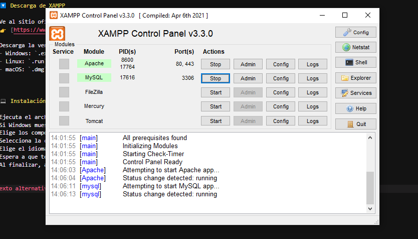
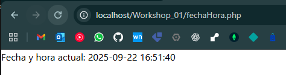
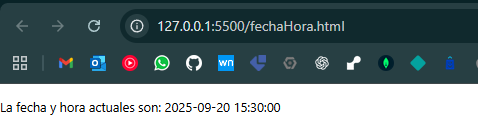

# Instalación de XAMPP

## Guía de Instalación de XAMPP

XAMPP es un paquete gratuito que incluye **Apache, MariaDB/MySQL, PHP y Perl**, lo que permite crear un entorno de servidor local para desarrollo web.

---

## 📋 Requisitos previos

- **Sistema operativo**: Windows, Linux o macOS.  
- **Permisos de administrador** en el sistema.  
- **Espacio en disco**: Al menos 1 GB libre.  
- **Conexión a internet** para descargar el instalador.

---

## 🔽 Descarga de XAMPP

1. Ve al sitio oficial de Apache Friends:  
   👉 [https://www.apachefriends.org/es/index.html](https://www.apachefriends.org/es/index.html)

2. Descarga la versión de XAMPP correspondiente a tu sistema operativo.  
   - Windows: `.exe`  
   - Linux: `.run`  
   - macOS: `.dmg`

---

## 💻 Instalación en Windows
/
1. Ejecuta el archivo descargado (`xampp-windows-x64-*.exe`).
2. Si Windows muestra un aviso de seguridad, selecciona **Permitir**.
3. Elige los componentes a instalar (recomendado dejar los predeterminados).
4. Selecciona la carpeta de instalación (por defecto: `C:\xampp`).
5. Elige el idioma.
6. Espera a que termine la instalación.
7. Al finalizar, abre el **Panel de Control de XAMPP**.

---




---

## Mostrar Fecha y Hora: 


### Código PHP

```<?php
// Mostrar la fecha y hora actual
date_default_timezone_set('America/New_York'); 
echo "Fecha y hora actual: " . date('Y-m-d H:i:s');
?>
```

Resultado: 




---

### Código HTML
```
<!DOCTYPE html>
<html lang="en">
<head>
    <meta charset="UTF-8">
    <meta name="viewport" content="width=device-width, initial-scale=1.0">
    <title>Fecha y Hora HTML</title>
</head>
<body>
     <p>La fecha y hora actuales son: 2025-09-20 15:30:00</p>
     <p></p>

</body>
</html>
```
Resultado: 





---v

## Diferencias.

La diferencia entre una y otra es que el código php se ejecuta desde su servidor en la web y por ende cada vez que se refresca el navegador, este actualiza la fechay hora. Por otra parte el archivo html es solo texto plano escrito, este solo se muestra lo que se se escribió y al no tener un archivo/código javascript no actualiza la hora y fecha, solo imprime lo que se escribió en él.

