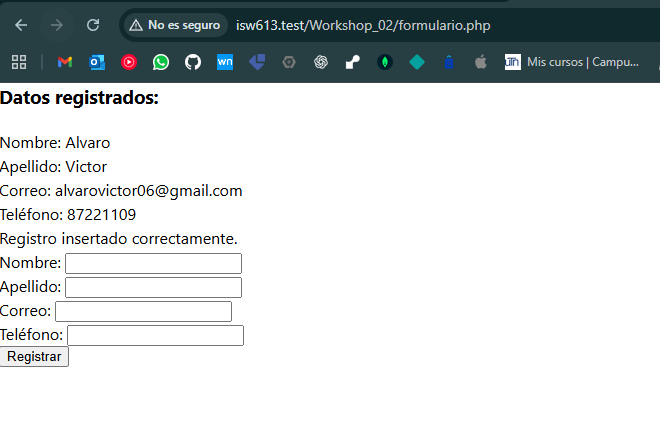
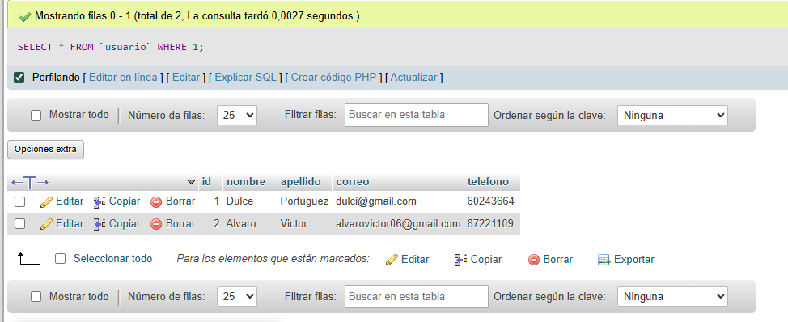

# Workshop 02 – Formulario en PHP con MySQL

## 📋 Objetivo
Crear una página web en PHP que reciba los datos de un formulario: **Nombre, Apellido, Correo y Teléfono**, y los inserte en una **base de datos MySQL** utilizando XAMPP como entorno local.

---

## 🔽 Creación de la Base de Datos y Tabla

1. Abrir **phpMyAdmin** en XAMPP:  
   `http://localhost/phpmyadmin`  
2. Crear la base de datos llamada: `workshop_02`.  
3. Crear la tabla `usuarios` con los siguientes campos:

| Campo     | Tipo         | Nulo | Extra                  |
|-----------|-------------|------|-----------------------|
| id        | INT         | ❌   | AUTO_INCREMENT, PK     |
| nombre    | VARCHAR(50) | ❌   |                       |
| apellido  | VARCHAR(50) | ✅   |                       |
| correo    | VARCHAR(100)| ❌   |                       |
| telefono  | VARCHAR(20) | ✅   |                       |

**SQL equivalente:**
```sql
CREATE DATABASE workshop_02;

USE workshop_02;

CREATE TABLE usuarios (
    id INT AUTO_INCREMENT PRIMARY KEY,
    nombre VARCHAR(50) NOT NULL,
    apellido VARCHAR(50),D
    correo VARCHAR(100) NOT NULL,
    telefono VARCHAR(20)
);
```


---

## 🔽 Registro y envio de Datos

Creamos nuestro código del formulario y lo enviamos con el metódo POST para realizar el registro, luego realizamos la conexion a la BD creada y le enviamos los datos.


---
``` php
<?php
// Procesar el formulario cuando se envía
if ($_SERVER["REQUEST_METHOD"] == "POST") {
    $nombre = $_POST['nombre'] ?? '';
    $apellido = $_POST['apellido'] ?? '';
    $correo = $_POST['correo'] ?? '';
    $telefono = $_POST['telefono'] ?? '';

    // Mostrar datos que se van a registrar
    echo "<h3>Datos registrados:</h3>";
    echo "Nombre: $nombre<br>";
    echo "Apellido: $apellido<br>";
    echo "Correo: $correo<br>";
    echo "Teléfono: $telefono<br>";


     $conn = new mysqli("localhost", "root", "", "Workshop02");

    // Conexión
    if ($conn->connect_error) {
        die("Error de conexión: " . $conn->connect_error);
    }

    // Insertar datos en la tabla
    $sql = "INSERT INTO usuario (nombre, apellido, correo, telefono) 
            VALUES ('$nombre', '$apellido', '$correo', '$telefono')";

    if ($conn->query($sql) === TRUE) {
        echo "Registro insertado correctamente.";
    } else {
        echo "Error: " . $sql . "<br>" . $conn->error;
    }

    $conn->close();

}
?>

<!-- Formulario HTML -->
<form method="post" action="">
    <label>Nombre:</label>
    <input type="text" name="nombre" required><br>
    <label>Apellido:</label>
    <input type="text" name="apellido" required><br>
    <label>Correo:</label>
    <input type="email" name="correo" required><br>
    <label>Teléfono:</label>
    <input type="text" name="telefono" required><br>
    <input type="submit" value="Registrar">
</form>
```


----


## 🔽 Registro final de Datos en MySQL

Datos registrados en la Base de Datos.


