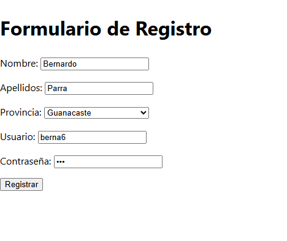
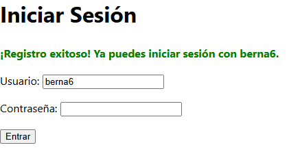
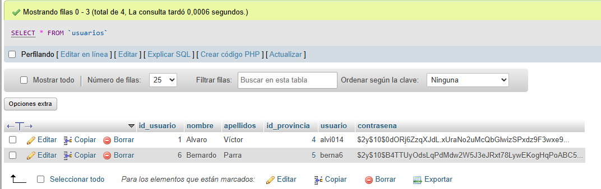

# 🧩 Workshop 03 – Formulario POST Completo (Registro, BD y Redirección)

## 🎯 Objetivo
Desarrollar un sistema de registro de usuarios en **PHP** que cumpla los siguientes requisitos:

1. Formulario **POST** con los campos:
   - Nombre  
   - Apellidos  
   - Usuario  
   - Contraseña  
2. Un **dropdown de Provincia** que lee datos desde la base de datos.
3. Inserción de todos los datos en la tabla **usuarios**.
4. Redirección a `login.php`, precargando el **nombre de usuario** recién registrado.

---

## 🗄️ Estructura de la Base de Datos (`workshop03`)

El ejercicio utiliza dos tablas relacionadas: **provincia** (para lectura) y **usuarios** (para escritura).

---

### 🅰️ Tabla `provincia`  
Esta tabla alimenta el dropdown de provincias en el formulario de registro.

| Campo           | Tipo        | Nulo | Extra                         |
|-----------------|--------------|------|--------------------------------|
| id_provincia    | INT(11)      | ❌    | AUTO_INCREMENT, PK             |
| nombreProvincia | VARCHAR(50)  | ❌    |                                |

#### 📘 Script SQL
```sql
CREATE TABLE IF NOT EXISTS provincia (
  id_provincia INT AUTO_INCREMENT PRIMARY KEY,
  nombreProvincia VARCHAR(50) NOT NULL
);

INSERT INTO provincia (nombreProvincia) VALUES
('Alajuela'),
('Heredia'),
('Cartago'),
('Puntarenas'),
('Guanacaste'),
('San José'),
('Limón');
```


---

### 🅱️ Tabla usuarios

Esta tabla almacena la información registrada, incluyendo la clave foránea a la provincia y la contraseña hasheada.

| Campo        | Tipo         | Nulo | Extra                        |
| ------------ | ------------ | ---- | ---------------------------- |
| id_usuario   | INT(11)      | ❌    | AUTO_INCREMENT, PK           |
| nombre       | VARCHAR(50)  | ❌    |                              |
| apellidos    | VARCHAR(80)  | ❌    |                              |
| id_provincia | INT(11)      | ✅    | FK a provincia(id_provincia) |
| usuario      | VARCHAR(50)  | ❌    | UNIQUE                       |
| contrasena   | VARCHAR(255) | ❌    | Almacena hash seguro         |


```sql
CREATE TABLE IF NOT EXISTS usuarios (
  id_usuario INT AUTO_INCREMENT PRIMARY KEY,
  nombre VARCHAR(50) NOT NULL,
  apellidos VARCHAR(80) NOT NULL,
  id_provincia INT,
  usuario VARCHAR(50) NOT NULL UNIQUE,
  contrasena VARCHAR(255) NOT NULL,
  FOREIGN KEY (id_provincia) REFERENCES provincia(id_provincia)
);

```




---
### 🧱 Estructura de Archivos (MVC básico)

El proyecto implementa una separación de lógica sencilla estilo MVC:

    *   Modelo: conexion.php (conexión a BD)

    *   Vista: registro_form.php (formulario HTML)

    *   Controlador: procesar_registro.php (lógica de negocio)

    *   Redirección: login.php (página de acceso)


``` pgsql
Workshop_03/
│
├── conexion.php
├── registro_form.php
├── procesar_registro.php
└── login.php

```

### 📄 1. conexion.php (Modelo)

``` php
// Archivo: conexion.php
$host = 'localhost'; 
$db   = 'workshop03';
$user = 'root'; 
$pass = ''; 
$charset = 'utf8mb4';

$dsn = "mysql:host=$host;dbname=$db;charset=$charset";
$options = [
    PDO::ATTR_ERRMODE            => PDO::ERRMODE_EXCEPTION,
    PDO::ATTR_DEFAULT_FETCH_MODE => PDO::FETCH_ASSOC,
    PDO::ATTR_EMULATE_PREPARES   => false,
];

try {
    $pdo = new PDO($dsn, $user, $pass, $options);
} catch (\PDOException $e) {
    // Si la conexión falla, detenemos el script con un error claro.
    die("Error de conexión a la base de datos: " . $e->getMessage());
}
```
--- 
### 📄 2. registro_form.php (Vista)
``` php
<?php
// Conexión a la BD para OBTENER las provincias
require 'conexion.php';

$mensaje = '';

// Lógica de LECTURA: Leer provincias de la BD 
$provincias = [];
try {
   $stmt = $pdo->query('SELECT id_provincia AS id, nombreProvincia FROM provincia ORDER BY nombreProvincia');
    $provincias = $stmt->fetchAll();
} catch (PDOException $e) {
    $mensaje = 'Error al cargar las provincias: ' . $e->getMessage();
}

// Lógica para mostrar mensajes de error/éxito
if (isset($_GET['error'])) {
    $mensaje = htmlspecialchars($_GET['error']);
}
?>

<!DOCTYPE html>
<html lang="es">
<head>
    <meta charset="UTF-8">
    <title>Registro de Usuario (Formulario)</title>
</head>
<body>
    <h1>Formulario de Registro</h1>
    <?php if ($mensaje): ?>
        <p style="color: red;"><?= $mensaje ?></p>
    <?php endif; ?>

    <form method="POST" action="procesar_registro.php"> 
        <p>
            <label for="nombre">Nombre:</label>
            <input type="text" id="nombre" name="nombre" required>
        </p>
        <p>
            <label for="apellidos">Apellidos:</label>
            <input type="text" id="apellidos" name="apellidos" required>
        </p>
        
        <p>
            <label for="id_provincia">Provincia:</label>
            <select id="id_provincia" name="id_provincia" required>
                <option value="">Seleccione una provincia</option>
                <?php foreach ($provincias as $provincia): ?>
                    <option value="<?= htmlspecialchars($provincia['id']) ?>">
                        <?= htmlspecialchars($provincia['nombreProvincia']) ?>
                    </option>
                <?php endforeach; ?>
            </select>
        </p>

        <p>
            <label for="usuario">Usuario:</label>
            <input type="text" id="usuario" name="usuario" required>
        </p>
        <p>
            <label for="contrasena">Contraseña:</label>
            <input type="password" id="contrasena" name="contrasena" required>
        </p>
        
        <p>
            <button type="submit">Registrar</button>
        </p>
    </form>
</body>
</html>
```

---

### 📄 3. procesar_registro.php (Controlador)

``` php
<?php

require 'conexion.php';

// Solo permitir POST
if ($_SERVER['REQUEST_METHOD'] !== 'POST') {
    header('Location: registro_form.php');
    exit();
}

// Captura de datos
$nombre = trim($_POST['nombre'] ?? '');
$apellidos = trim($_POST['apellidos'] ?? '');
// El campo del formulario probablemente se llama 'id_provincia' como en el HTML, no 'provincia'.
$id_provincia = (int)($_POST['id_provincia'] ?? 0); 
$usuario = trim($_POST['usuario'] ?? '');
$contrasena_plana = $_POST['contrasena'] ?? '';

// Validación básica
if (empty($nombre) || empty($apellidos) || $id_provincia === 0 || empty($usuario) || empty($contrasena_plana)) {
    $error_msg = "Todos los campos son obligatorios.";
    header('Location: registro_form.php?error=' . urlencode($error_msg));
    exit();
}

try {
    $sql = "INSERT INTO usuarios (nombre, apellidos, id_provincia, usuario, contrasena) 
            VALUES (:nombre, :apellidos, :id_provincia, :usuario, :contrasena)";
    $stmt = $pdo->prepare($sql); 
    $stmt->execute([
        ':nombre' => $nombre,
        ':apellidos' => $apellidos,
        ':id_provincia' => $id_provincia,
        ':usuario' => $usuario,
        ':contrasena' => password_hash($contrasena_plana, PASSWORD_DEFAULT) 
    ]);
    $usuario_registrado = urlencode($usuario); 
    header("Location: login.php?username={$usuario_registrado}");
    exit();

} catch (PDOException $e) {
    $error_msg = "Error al registrar: " . $e->getMessage();
    header('Location: registro_form.php?error=' . urlencode($error_msg));
    exit();
}


```
--- 

### 📄 4. login.php (Redirección y Precarga)
``` php
<?php
// Inicializar la variable que contendrá el valor del campo
$username_value = '';
$mensaje_exito = '';

// 1. Verificar si la URL contiene el parámetro 'username'
if (isset($_GET['username'])) {
    // 2. Leer el valor y lo limpiamos para evitar inyecciones HTML (XSS).
    $username_value = htmlspecialchars($_GET['username']);
    
   
    $mensaje_exito = '¡Registro exitoso! Ya puedes iniciar sesión con ' . $username_value . '.';
}
?>

<!DOCTYPE html>
<html lang="es">
<head>
    <meta charset="UTF-8">
    <title>Iniciar Sesión</title>
</head>
<body>
    <h1>Iniciar Sesión</h1>
    
    <?php if ($mensaje_exito): ?>
        <p style="color: green; font-weight: bold;"><?= $mensaje_exito ?></p>
    <?php endif; ?>

    <form method="POST" action="validar_login.php"> 
        <p>
            <label for="username">Usuario:</label>
            <input type="text" id="username" name="username" 
                   value="<?= $username_value ?>" required>
        </p>
        <p>
            <label for="password">Contraseña:</label>
            <input type="password" id="password" name="password" required>
        </p>
        
        <p>
            <button type="submit">Entrar</button>
           
        </p>
    </form>
</body>
</html>
```
 --- 
## 🎯 Verificación del Resultado
### 🅰️ Inserción en la BD

Los datos se insertan correctamente en la tabla usuarios, verificando que:

id_provincia guarda la clave foránea correcta.

contrasena se almacena en formato hash seguro (password_hash()).



🅱️ Redirección Correcta

Después del registro, el sistema redirige a login.php, mostrando el nombre de usuario recién creado en el campo de texto.

